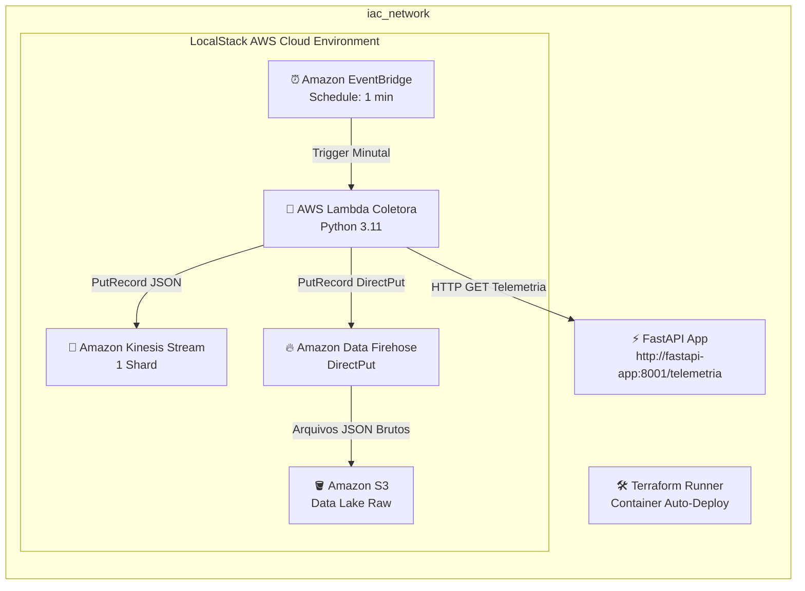

# 📡 IoT Sensor Telemetry - Real-Time Data Pipeline (LocalStack + Terraform + FastAPI)


---

## 🎯 Objetivo do Projeto

Este projeto consiste em um **Pipeline de Engenharia de Dados em Tempo Real** focado em **Telemetria de Dispositivos IoT**. O objetivo é simular sensores industriais (temperatura, pressão, umidade, vibração) que geram dados contínuos e anomalias operacionais, coletá-los de forma automatizada e transmiti-los para um **Data Lake em camadas brutas no Amazon S3**.

Todo o ecossistema é **100% containerizado e executado localmente**, utilizando o **LocalStack** para emulação da AWS e o **Terraform** rodando via container Docker automatizado para o provisionamento de Infraestrutura como Código (IaC).

---

## 🏗️ Arquitetura da Solução



### Fluxo de Dados:
1. **Origem (API FastAPI)**: Uma API REST simuladora de sensores IoT exposta na porta `8001`. Injeta ~15% de anomalias aleatórias (picos de temperatura, valores nulos, erros de pressão).
2. **Agendamento (EventBridge)**: Dispara a execução da Lambda Coletora a cada 1 minuto (`rate(1 minute)`).
3. **Coleta (AWS Lambda)**: Faz uma requisição `GET` para a API através da rede virtual interna Docker (`http://fastapi-app:8001/telemetria`).
4. **Streaming (Amazon Kinesis)**: Recebe e armazena o evento de telemetria em tempo real (1 Shard).
5. **Entrega & Ingestão (Data Firehose & S3)**: O Data Firehose entrega os arquivos brutos JSON no **Data Lake S3** (`telemetry-data-lake/raw/`).

---

## 🛠️ Tecnologias e Stacks Utilizadas

| Categoria | Tecnologia | Descrição |
| :--- | :--- | :--- |
| **Linguagem** |  | Simulação de IoT e código da Lambda Coletora |
| **API Web** |  | Endpoint simulador de sensores IoT |
| **IaC** |  | Provisionamento de infraestrutura AWS automatizado via container |
| **Containers** |   | Orquestração dos containers em rede isolada `iac_network` |
| **Cloud Emulation** |  | Emulação local dos serviços AWS |
| **AWS Services** |      | Infraestrutura Serverless e Streaming de Dados |

---

## 📂 Estrutura do Projeto

```text
iac_terraform/
├── api/
│   ├── app.py              # Aplicação FastAPI simuladora de sensores IoT com anomalias
│   ├── Dockerfile          # Imagem Docker da API FastAPI
│   └── requirements.txt    # Dependências da API (fastapi, uvicorn)
├── src/
│   └── lambda_function.py  # Código Python da AWS Lambda Coletora
├── .env                    # Arquivo de variáveis locais (contém LOCALSTACK_AUTH_TOKEN)
├── .env.example            # Modelo de referência para variáveis de ambiente
├── .gitignore              # Ignora tokens e estados temporários do Terraform
├── docker-compose.yml      # Orquestração do LocalStack, FastAPI e Terraform Runner
├── main.tf                 # Declaração Terraform da infraestrutura AWS no LocalStack
└── README.md               # Documentação do projeto
```

---

## 🚀 Como Executar o Projeto

### Pré-requisitos
- **Docker** e **Docker Compose** instalados.
- Token do LocalStack configurado no arquivo `.env` (exemplo abaixo).

### 1. Configurar o arquivo `.env`
Crie um arquivo `.env` na raiz do projeto com o seu token do LocalStack:
```bash
LOCALSTACK_AUTH_TOKEN=seu_token_localstack_aqui
```

### 2. Iniciar os Containers (API + LocalStack + Terraform Runner)
Execute um único comando para construir e subir todo o ambiente:
```bash
docker compose up -d --build
```

### 3. Acompanhar a Aplicação do Terraform
O container `terraform-runner` irá esperar o LocalStack inicializar e aplicará toda a infraestrutura AWS automaticamente:
```bash
docker logs -f terraform-runner
```
*(Ao final, você verá a mensagem: `Infraestrutura AWS local provisionada com sucesso!`)*

---

## 🧪 Testes e Validação de Dados

### 1. Testar o Endpoint da API FastAPI
Você pode gerar dados de telemetria manualmente acessando `http://localhost:8001/telemetria` ou via `curl`:
```bash
curl http://localhost:8001/telemetria
```

**Exemplo de Payload com Anomalia Simulada:**
```json
{
  "device_id": "sensor_temperatura_01",
  "sensor_type": "temperatura",
  "reading_value": 1250.4,
  "unit": "°C",
  "location_zone": "ZONE_A",
  "operational_status": "CRITICAL",
  "is_anomaly": true,
  "anomaly_type": "extreme_temperature_spike",
  "timestamp": "2026-08-29T22:30:00.000000+00:00"
}
```

### 2. Verificar os Logs de Invocação da Lambda
Veja o LocalStack disparando a Lambda a cada 1 minuto:
```bash
docker logs -f localstack | grep -i lambda
```

### 3. Consultar os Dados no S3 Data Lake
Após 1-2 minutos de execução do EventBridge, liste os arquivos brutos entregues no bucket S3:
```bash
aws --endpoint-url=http://localhost:4566 s3 ls s3://telemetry-data-lake/raw/ --recursive
```

Para inspecionar o conteúdo de um arquivo salvo no Data Lake:
```bash
aws --endpoint-url=http://localhost:4566 s3 cp s3://telemetry-data-lake/raw/<NOME_DO_ARQUIVO.json> -
```

---

## 🧹 Limpeza do Ambiente

Para parar e remover todos os containers e redes criados:
```bash
docker compose down -v
```
